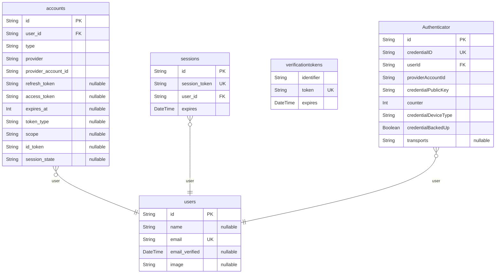

# Prisma Markdown
> Generated by [`prisma-markdown`](https://github.com/samchon/prisma-markdown)

- [default](#default)

## default

### `accounts`

**Properties**
  - `id`: 
  - `user_id`: 
  - `type`: 
  - `provider`: 
  - `provider_account_id`: 
  - `refresh_token`: 
  - `access_token`: 
  - `expires_at`: 
  - `token_type`: 
  - `scope`: 
  - `id_token`: 
  - `session_state`: 

### `sessions`

**Properties**
  - `id`: 
  - `session_token`: 
  - `user_id`: 
  - `expires`: 

### `users`

**Properties**
  - `id`: 
  - `name`: 
  - `email`: 
  - `email_verified`: 
  - `image`: 

### `verificationtokens`

**Properties**
  - `identifier`: 
  - `token`: 
  - `expires`: 

### `Authenticator`

**Properties**
  - `id`: 
  - `credentialID`: 
  - `userId`: 
  - `providerAccountId`: 
  - `credentialPublicKey`: 
  - `counter`: 
  - `credentialDeviceType`: 
  - `credentialBackedUp`: 
  - `transports`: 